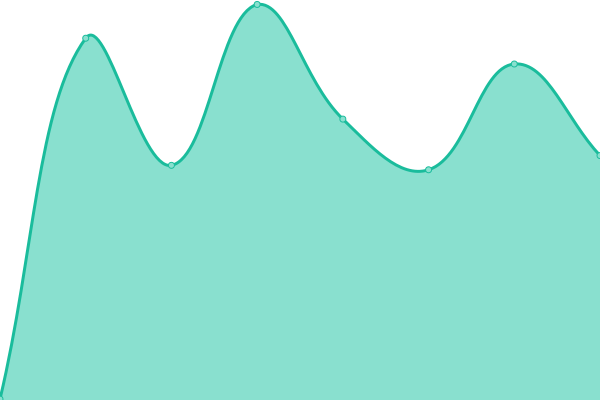
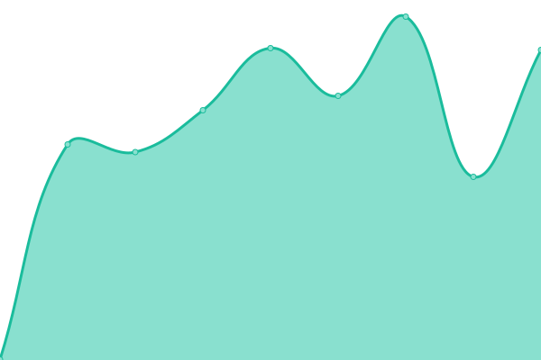
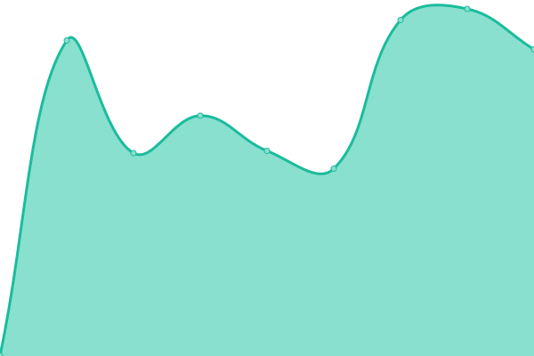
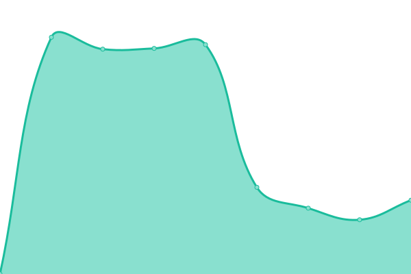

# [📈 Live Status](https://Webdeporte.github.io/statuspage): <!--live status--> **🟧 Partial outage**

This repository contains the open-source uptime monitor and status page for [Webdeporte](https://Webdeporte.github.io/statuspage), powered by [Upptime](https://github.com/upptime/upptime).

With [Upptime](https://upptime.js.org), you can get your own unlimited and free uptime monitor and status page, powered entirely by a GitHub repository. We use [Issues](https://github.com/Webdeporte/statuspage/issues) as incident reports, [Actions](https://github.com/Webdeporte/statuspage/actions) as uptime monitors, and [Pages](https://Webdeporte.github.io/statuspage) for the status page.

<!--start: status pages-->
<!-- This summary is generated by Upptime (https://github.com/upptime/upptime) -->
<!-- Do not edit this manually, your changes will be overwritten -->
<!-- prettier-ignore -->
| URL | Status | History | Response Time | Uptime |
| --- | ------ | ------- | ------------- | ------ |
|  [Ibertenis](http://ibertenis.com) | 🟩 Up | [ibertenis.yml](https://github.com/Webdeporte/statuspage/commits/HEAD/history/ibertenis.yml) | 

 625ms
     
 | 

<a href="https://Webdeporte.github.io/statuspage/history/ibertenis">100.00%</a>
    

|  [Webdeporte PRESTASHOP](http://www.webdeporte.com) | 🟩 Up | [webdeporte-prestashop.yml](https://github.com/Webdeporte/statuspage/commits/HEAD/history/webdeporte-prestashop.yml) | 

 1347ms
     
 | 

<a href="https://Webdeporte.github.io/statuspage/history/webdeporte-prestashop">100.00%</a>
    

|  [SSO](https://sso.zeltik.es/auth) | 🟩 Up | [sso.yml](https://github.com/Webdeporte/statuspage/commits/HEAD/history/sso.yml) | 

 763ms
     
 | 

<a href="https://Webdeporte.github.io/statuspage/history/sso">98.94%</a>
    

|  [ODOO twelvepadelzenter](http://188.165.243.166:8060) | 🟩 Up | [odoo-twelvepadelzenter.yml](https://github.com/Webdeporte/statuspage/commits/HEAD/history/odoo-twelvepadelzenter.yml) | 

 281ms
     
 | 

<a href="https://Webdeporte.github.io/statuspage/history/odoo-twelvepadelzenter">100.00%</a>
    

|  [twelvepadelzenter](https://oficina.twelvepadelzenter.com/ht/) | 🟩 Up | [twelvepadelzenter.yml](https://github.com/Webdeporte/statuspage/commits/HEAD/history/twelvepadelzenter.yml) | 

 644ms
     
 | 

<a href="https://Webdeporte.github.io/statuspage/history/twelvepadelzenter">98.94%</a>
    

|  [rtsport](https://oficina.rtsport.es/ht/) | 🟥 Down | [rtsport.yml](https://github.com/Webdeporte/statuspage/commits/HEAD/history/rtsport.yml) | 

 0ms
     
 | 

<a href="https://Webdeporte.github.io/statuspage/history/rtsport">0.00%</a>
    

|  [ureca](https://oficina.ureca.es/ht/) | 🟥 Down | [ureca.yml](https://github.com/Webdeporte/statuspage/commits/HEAD/history/ureca.yml) | 

 751ms
     
 | 

<a href="https://Webdeporte.github.io/statuspage/history/ureca">34.17%</a>
    

|  [zeltik](https://club.zeltik.es/ht/) | 🟥 Down | [zeltik.yml](https://github.com/Webdeporte/statuspage/commits/HEAD/history/zeltik.yml) | 

 0ms
     
 | 

<a href="https://Webdeporte.github.io/statuspage/history/zeltik">0.00%</a>
    

|  [recpadel](https://oficinarecpadel.xestos.es/ht/) | 🟩 Up | [recpadel.yml](https://github.com/Webdeporte/statuspage/commits/HEAD/history/recpadel.yml) | 

 665ms
     
 | 

<a href="https://Webdeporte.github.io/statuspage/history/recpadel">98.94%</a>
    

|  [atlantic](https://oficina.atlantictennisacademy.com/ht/) | 🟥 Down | [atlantic.yml](https://github.com/Webdeporte/statuspage/commits/HEAD/history/atlantic.yml) | 

 0ms
     
 | 

<a href="https://Webdeporte.github.io/statuspage/history/atlantic">0.00%</a>
    

|  [cluteca](https://oficina.cluteca.com/ht) | 🟥 Down | [cluteca.yml](https://github.com/Webdeporte/statuspage/commits/HEAD/history/cluteca.yml) | 

 0ms
     
 | 

<a href="https://Webdeporte.github.io/statuspage/history/cluteca">0.00%</a>
    

|  [hipica](https://hipica.xestos.com/ht) | 🟥 Down | [hipica.yml](https://github.com/Webdeporte/statuspage/commits/HEAD/history/hipica.yml) | 

 0ms
     
 | 

<a href="https://Webdeporte.github.io/statuspage/history/hipica">0.00%</a>
    

|  [casinocoruna](https://oficina.casinocoruna.xestos.es/ht) | 🟥 Down | [casinocoruna.yml](https://github.com/Webdeporte/statuspage/commits/HEAD/history/casinocoruna.yml) | 

 0ms
     
 | 

<a href="https://Webdeporte.github.io/statuspage/history/casinocoruna">0.00%</a>
    

|  [mercantilvigo](https://oficina.mercantilvigo.xestos.es/ht) | 🟥 Down | [mercantilvigo.yml](https://github.com/Webdeporte/statuspage/commits/HEAD/history/mercantilvigo.yml) | 

 0ms
     
 | 

<a href="https://Webdeporte.github.io/statuspage/history/mercantilvigo">0.00%</a>
    

|  [padelbao](https://oficina.padelbao.xestos.es/ht) | 🟥 Down | [padelbao.yml](https://github.com/Webdeporte/statuspage/commits/HEAD/history/padelbao.yml) | 

 0ms
     
 | 

<a href="https://Webdeporte.github.io/statuspage/history/padelbao">0.00%</a>
    

|  [reservas ureca](http://reservas.ureca.es) | 🟩 Up | [reservas-ureca.yml](https://github.com/Webdeporte/statuspage/commits/HEAD/history/reservas-ureca.yml) | 

 388ms
     
 | 

<a href="https://Webdeporte.github.io/statuspage/history/reservas-ureca">100.00%</a>
    

|  [reservas 12zenter](http://reservas.twelvepadelzenter.com) | 🟩 Up | [reservas-12zenter.yml](https://github.com/Webdeporte/statuspage/commits/HEAD/history/reservas-12zenter.yml) | 

 354ms
     
 | 

<a href="https://Webdeporte.github.io/statuspage/history/reservas-12zenter">100.00%</a>
    

|  [tpv recpadel](https://pos.recpadel.xestos.es/) | 🟩 Up | [tpv-recpadel.yml](https://github.com/Webdeporte/statuspage/commits/HEAD/history/tpv-recpadel.yml) | 

 962ms
     
 | 

<a href="https://Webdeporte.github.io/statuspage/history/tpv-recpadel">100.00%</a>
    

<!--end: status pages-->

[**Visit our status website →**](https://Webdeporte.github.io/statuspage)

## 📄 License

- Powered by: [Upptime](https://github.com/upptime/upptime)
- Code: [MIT](./LICENSE) © [Webdeporte](https://Webdeporte.github.io/statuspage)
- Data in the `./history` directory: [Open Database License](https://opendatacommons.org/licenses/odbl/1-0/)
